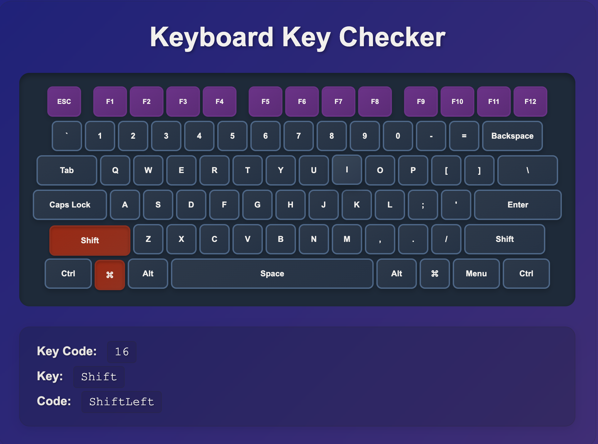

# Keyboard Key Checker



A web application that displays an 85-key keyboard layout with real-time key press detection. When you press physical keyboard keys, the corresponding keys on the screen highlight in red, and key information is displayed below.

## Features

- Visual 85-key keyboard layout display
- Real-time key press detection
- Display of key code, key name, and code value
- Responsive design
- Docker Compose support

## Setup

### Requirements

- Docker & Docker Compose

### Getting Started

1. Clone/download the repository
2. Navigate to the project directory
3. Start the application

```bash
# Build and start
docker compose up --build -d

# Stop
docker compose down

# View logs
docker compose logs
```

## Access

The application can be accessed at:

**http://localhost:3000**

After accessing in your browser, press any keyboard key to see it highlighted on screen with key information displayed below.

## Tech Stack

- **Runtime**: Bun 1.2.21
- **Frontend**: HTML5, CSS3, JavaScript (Vanilla)
- **Backend**: Bun HTTP Server
- **Containerization**: Docker & Docker Compose

